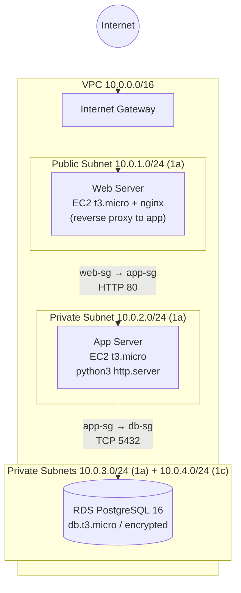
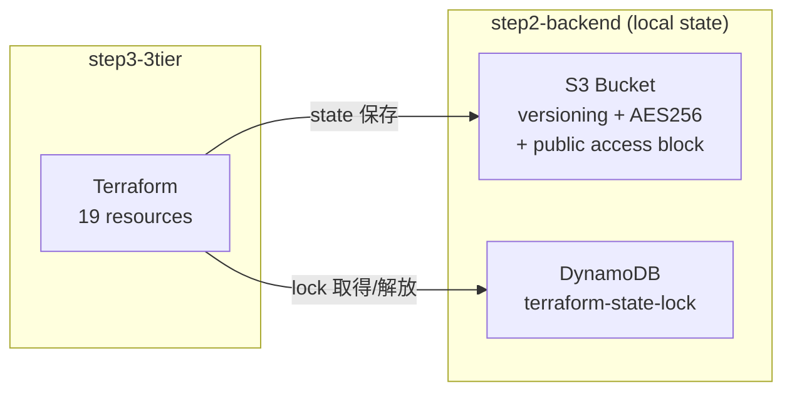

# AWS 3-Tier Architecture with Terraform

[手動構築した 3 層アーキテクチャ](https://github.com/gituser-josh/aws-3tier-webapp) を Terraform で完全コード化したプロジェクト。S3 リモートステート + DynamoDB ロックによるチーム運用可能な構成。

## アーキテクチャ



セキュリティグループは CIDR ではなく **SG 参照チェーン**（web-sg → app-sg → db-sg）で各層の通信元を制限。

## ステート管理（Bootstrap パターン）



「ステート置き場を Terraform で作る」鶏卵問題は、**バックエンド自身は local state で管理**する Bootstrap パターンで解決。

## リポジトリ構成

| ディレクトリ | 内容 | ステート |
|---|---|---|
| `step1-hello/` | hello-world EC2 + SG（入門） | local |
| `step2-backend/` | S3 バケット + DynamoDB ロックテーブル | local（bootstrap） |
| `step3-3tier/` | 3 層構成本体（VPC / SG×3 / EC2×2 / RDS） | **S3 + DynamoDB** |

## 使い方

```bash
# 1. バックエンド構築（初回のみ・destroy しない）
cd step2-backend
terraform init && terraform apply

# 2. 3 層構成のデプロイ
cd ../step3-3tier
# terraform.tfvars を作成（git 管理外）
echo 'db_password = "YourSecurePassword"' > terraform.tfvars
terraform init && terraform apply

# 3. 動作確認
WEB_IP=$(terraform output -raw web_public_ip)
curl http://$WEB_IP/            # → Hello from WEB tier
curl http://$WEB_IP/app/index.html  # → Hello from APP tier（リバースプロキシ経由で private subnet へ）

# 4. 削除
terraform destroy
```

## 実測値（再現性テスト）

| 操作 | 所要時間 |
|---|---|
| 手動構築（前作 Phase 1） | 2〜3 日 |
| `terraform apply`（19 リソース・RDS 込み） | **5 分 19 秒** |
| `terraform destroy` | 約 3 分 |

destroy → apply のフルサイクルで同一構成が再現されることを確認済み。再構築後も RDS エンドポイント（identifier ベースの DNS 名）は不変。

## 設計上のポイント

- **user_data に `set -euo pipefail`**：失敗時にログ先頭で原因行が特定できる
- **app tier は python3 http.server**：NAT GW なしの private subnet では `dnf install` 不可のため、AL2023 標準搭載の python3 を利用（コスト最適化）
- **web → app 疎通テストは nginx リバースプロキシ**：SSH キーレス構成でも 3 層の内部通信をブラウザ/curl だけで検証可能
- **`sensitive = true` + tfvars 分離**：DB パスワードは plan 出力でマスクされ、git 管理外
- **`engine_version = "16"`**：メジャー指定でマイナーバージョン自動追従

## 環境

- Terraform v1.15.4 / AWS Provider ~> 5.0
- Region: ap-northeast-1
- WSL2 Ubuntu 24.04

## License

MIT